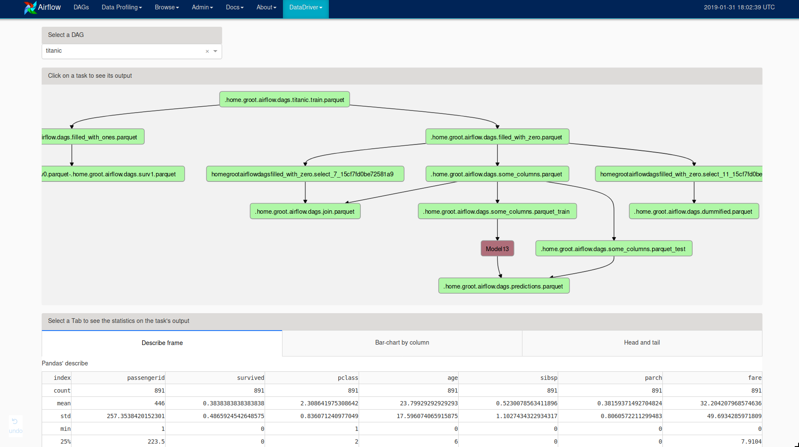
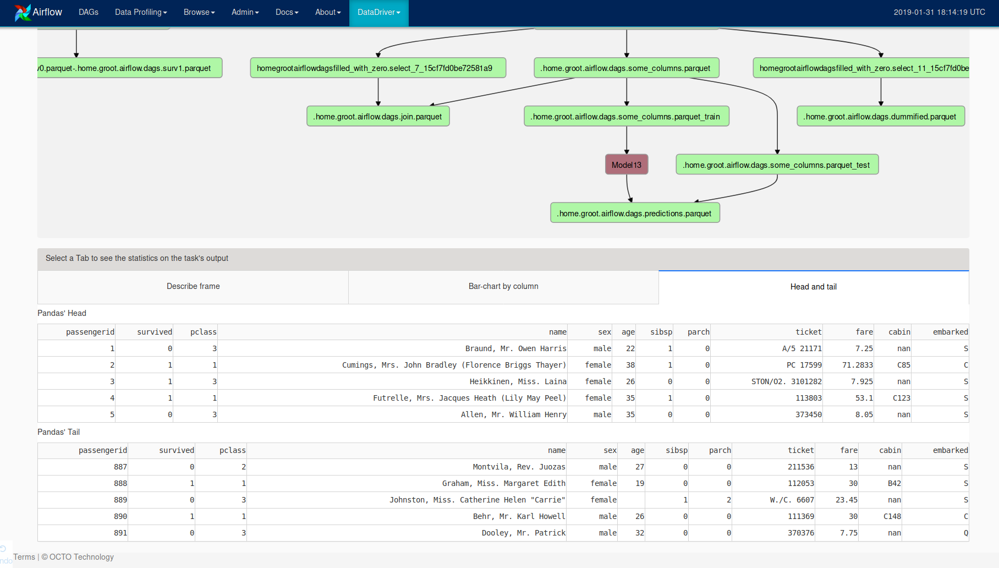
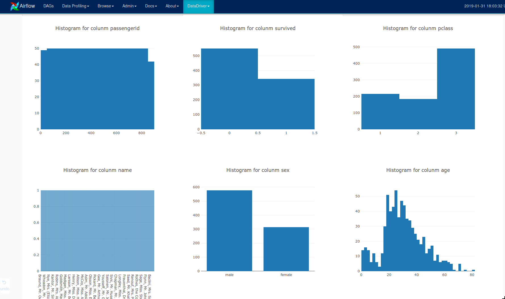
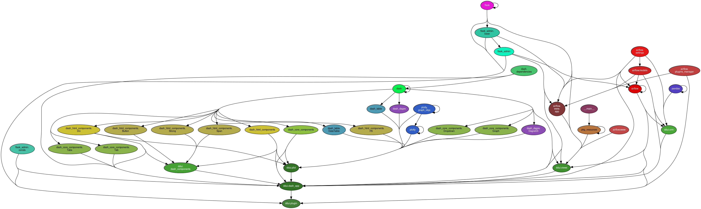

# Airflow's DataDriver plugin

## from Pandas' dataframes to Airflow pipelines

#### WHY : 

In a machine learning project, there is a recurring problem 
with the difference between local interactive modeling source code 
and production pipelines source code. 
It is very error prone and, as a consequence, time consuming because we 
switch constantly between experimentation and production.
 
The Datadriver project aims to solve this issue by making the glue code **based on Pandas and sklearn**
for modelization, **and on Airflow** for automation, scheduling, and monitoring of training 
and predicting pipelines.

#### Plugin description

**Datadriver UI (ddui)** is the Airflow's plugin we developed to track our models. 
Combined with the Datadriver's API (pyddapi), it offers a DAG view to track machine learning workflow (or dataflow).

More specifically, it shows the **Output** of any Airflow's Task with a lot of metrics and
charts : 

 - choose a DAG to track

 - select a task to see charts and describe metrics on the output_table
 
 - look at histograms to verify if columns are correct (distributions, number of NAs,
  unique values, etc...)
 

## Getting started

from [PyPI.org](https://pypi.org/project/ddui/) :

    pip install ddui
    ddui install # link the plugin to airflow plugin's folder    

from source install :

    git clone git_url_of_this_project && cd this_project
    pip install -e .
    ddui install
    
docker install :

    ./run_docker.sh

## Package modules

    ddui/
        dash_app -> the application defined like a Dash application, with callbacks and event handeling. It is imported in plugin.py later
        dash_components -> html custom components like a Panel or an Alert Div
        orm -> function to access the Airflow metastore and retrieve DAGs list and infos
        plot -> functions using plotly, they return a Graph object
        plugin -> defines the DataDriverUI plugin that implements Airflow's Plugin interface https://airflow.apache.org/plugins.html#interface
        views -> a FlaskAdminView that implements Dash too, to have the ability to include plotly charts in Airflow
        

###### dependencies graph

       

## Developer setup

There is an existing DAG in tests/dags that mocks the behavior of Datadriver's API, but
without any dependency to pyddapi.

You can use it to develop the User Interface, using the script located in tests/dev_tools.
    
    cd tests/dev_tools
    python run_webserver.py
    
It runs the Airflow's webserver, and it overrides the AIRFLOW__CORE__DAGS_FOLDER to look into tests/dags.

### Setup your virtual env

    virtualenv venv
    source venv/bin/activate
    pip install -e .
    pip install -r ci/tests_requirements.txt
    ddui install
    

# Contributors

This repository is a part of the DataDriver project.
 
Since 2016, there were many people who contributed to this project : 

* Ali El Moussawi
* Arthur Baudry
* Augustin Grimprel
* Aurélien Massiot
* Benjamin Joyen-Conseil
* Constant Bridon
* Cyril Vinot
* Eric Biernat
* Jeffrey Lucas
* Nicolas Cavallo
* Nicolas Frot
* Matthieu Lagacherie  
* Mehdi Houacine
* Pierre Baonla Bassom
* Rémy Frenoy
* Romain Ayres
* Samuel Rochette
* Thomas Vial
* Veltin Dupont 
* Vincent Levorato
* Yannick Drant
* Yannick Schini
* Yasir Khan
